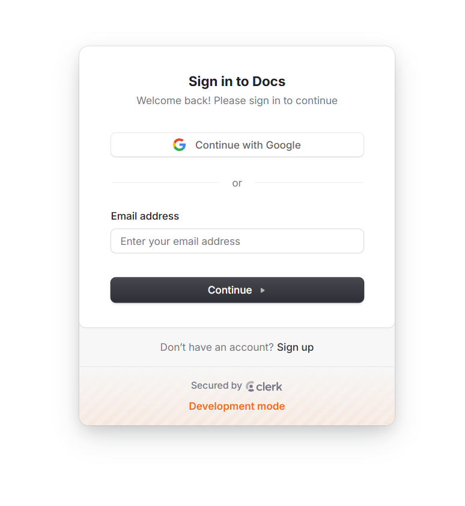
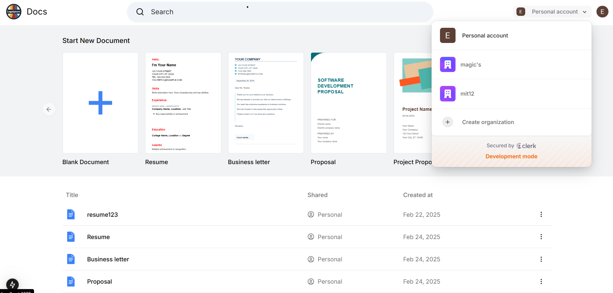
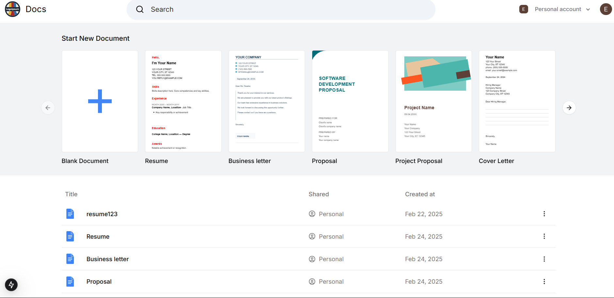
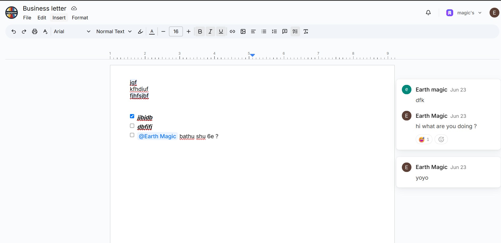
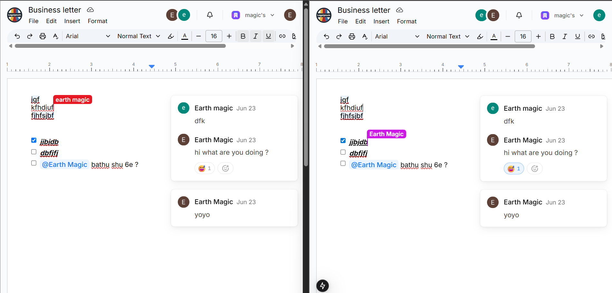
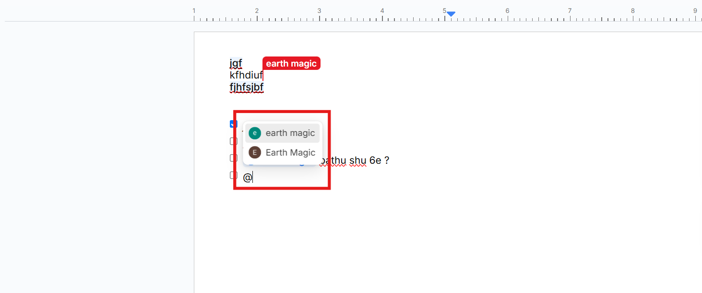
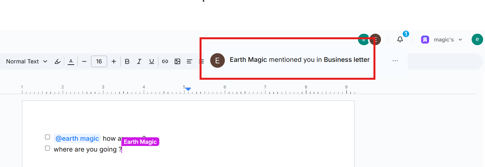

# 📝 Collabify

A modern, collaborative document editing platform inspired by Google Docs.  
Experience real-time editing, live presence, notifications, and a beautiful, accessible UI.

---

## 🚀 Key Features

- **Real-time Collaboration:**  
  Developed with Liveblocks, supporting up to 50 concurrent users per room.  
  Each user is visually distinguished by a unique cursor color for seamless multi-user tracking.

- **Infinite Canvas Editor:**  
  Built with Tiptap, enabling creation and editing of 10+ shape types (rectangle, ellipse, circle, and more) for flexible, interactive documents.

- **Role-Based Access Control (RBAC):**  
  Organizations can assign admin and member roles, ensuring secure collaboration and customizable workflows.

- **Authentication:**  
  Secure login & registration with Clerk, including organization support.

- **Document Management:**  
  Create, rename, delete, and share documents.  
  Quick actions and dashboard for easy navigation.

- **Notifications & Inbox:**  
  Real-time notifications for mentions and document updates, with an accessible inbox panel.

---

## 🎨 UI/UX Overview

### 🔑 Authentication
- **Secure login & registration** with Clerk.
- **Organization support** for team collaboration.
- **User avatars** and profile management.
- **Error handling** for unauthorized access.

**🖼 Screenshots:**  
  


---

### 🏠 Dashboard
- **Document List:** View all your documents with titles, owners, and last edited times.
- **Quick Actions:** Create, rename, or delete documents with a single click.

**🖼 Screenshots:**  
 

---

### 📝 Document Editor & Infinite Canvas
- **Rich Text Editing:** Clean, distraction-free writing experience.
- **Infinite Canvas:** Draw and edit shapes (rectangle, ellipse, circle, etc.) with Tiptap.
- **Live Presence:** See who’s online and editing with avatars and colored cursors.
- **Mentions:** Tag teammates and get instant notifications.
- **Formatting Toolbar:** Bold, italic, underline, headings, lists, and more.
- **Keyboard Shortcuts:** For power users.

**🖼 Screenshots:**  

  


---

### 🔔 Notifications & Inbox
- **Real-time notifications** for mentions and document updates.
- **Inbox panel** to view and manage all notifications.
- **Accessible notification badges** and toasts.

**🖼 Screenshots:**  
 

---

### 🛡️ Role-Based Access Control (RBAC)
- **Admin & Member Roles:** Assign and manage roles within organizations.
- **Secure Collaboration:** Only authorized users can access or modify documents.
- **Customizable Workflows:** Tailor permissions for different teams.

---


---

## 🛠️ Settings

- **Document Management:** Rename, delete, and share documents.
- **Organization Management:** Switch organizations, invite users.
- **User Settings:** Update profile, avatar, and preferences.

**🖼 Screenshots:**  
  


---

## 🏗️ Project Structure

```
google_doc/
├── src/
│   ├── app/
│   │   ├── (home)/
│   │   │   ├── documents-table.tsx
│   │   │   ├── document-row.tsx
│   │   │   ├── document-menu.tsx
│   │   │   └── page.tsx
│   │   └── documents/
│   │       ├── [documentId]/
│   │       │   ├── page.tsx
│   │       │   ├── room.tsx
│   │       │   ├── inbox.tsx
│   │       │   ├── navbar.tsx
│   │       │   ├── actions.ts
│   │       │   └── ...
│   ├── components/
│   │   ├── ui/
│   │   │   ├── button.tsx
│   │   │   ├── dropdown-menu.tsx
│   │   │   ├── table.tsx
│   │   │   └── ...
│   │   ├── rename-dialog.tsx
│   │   ├── remove-dialog.tsx
│   │   └── ...
│   ├── hooks/
│   │   └── use-debounce.ts
│   └── ...
├── convex/
│   ├── documents.ts
│   └── ...
├── public/
│   └── screenshots/
│       ├── login.png
│       ├── org-switcher.png
│       ├── dashboard.png
│       ├── dashboard-mobile.png
│       ├── editor.png
│       ├── canvas.png
│       ├── presence.png
│       ├── mentions.png
│       ├── inbox.png
│       ├── notification-toast.png
│       ├── mobile-editor.png
│       ├── mobile-menu.png
│       ├── rename-dialog.png
│       └── remove-dialog.png
├── tsconfig.json
├── next.config.js
└── ...
```

---

## 🗝️ .env.local File Structure

Create a `.env.local` file in the root of your project and add the following:

```env
CONVEX_DEPLOYMENT=your_convex_deployment_id
NEXT_PUBLIC_CONVEX_URL=your_convex_url
NEXT_PUBLIC_CLERK_PUBLISHABLE_KEY=your_clerk_publishable_key
LIVEBLOCKS_SECRET_KEY=your_liveblocks_secret_key
```

> Replace the values with your actual deployment keys.

---

## 🏁 Getting Started

1. **Clone the repository:**
   ```bash
   git clone https://github.com/MitBeladiya001/Collabify.git
   cd Collabify/google_doc
   ```

2. **Install dependencies:**
   ```bash
   npm install
   ```

3. **Add environment variables:**  
   Create a `.env.local` file and add your keys for Convex, Clerk, and Liveblocks.

4. **Run the app:**
   ```bash
   npm run dev
   ```
   Open [http://localhost:3000](http://localhost:3000) in your browser.

---

## 📝 Customization

- **Branding:**  
  Replace the logo and colors in `tailwind.config.ts` and `public/`.
- **UI Components:**  
  All UI elements are modular and can be extended or replaced.

---

## 📣 Feedback

We welcome feedback and contributions!  
Open an issue or submit a pull request to help improve the project.

---

## 📄 License

MIT

---

*This project is for educational/demo purposes and is not