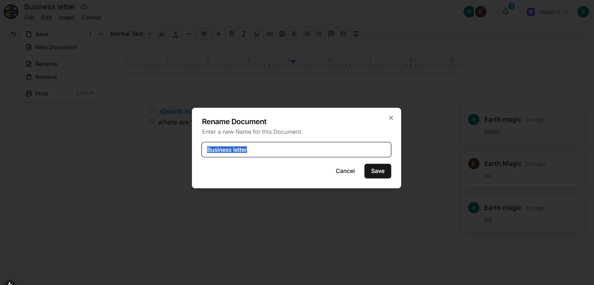

# 📝 Collabify

A modern, collaborative document editing platform inspired by Google Docs.  
Experience real-time editing, live presence, notifications, and a beautiful, accessible UI.

---

## 🎨 UI/UX Overview

### 🔑 Authentication
- **Secure login & registration** with Clerk.
- **Organization support** for team collaboration.
- **User avatars** and profile management.
- **Error handling** for unauthorized access.

**🖼 Screenshots:**  
  


---

### 🏠 Dashboard
- **Document List:** View all your documents with titles, owners, and last edited times.
- **Quick Actions:** Create, rename, or delete documents with a single click.

**🖼 Screenshots:**  
 

---

### 📝 Document Editor
- **Rich Text Editing:** Clean, distraction-free writing experience.
- **Live Presence:** See who’s online and editing with avatars.
- **Mentions:** Tag teammates and get instant notifications.
- **Formatting Toolbar:** Bold, italic, underline, headings, lists, and more.
- **Keyboard Shortcuts:** For power users.

**🖼 Screenshots:**  
  
  


---

### 🔔 Notifications & Inbox
- **Real-time notifications** for mentions and document updates.
- **Inbox panel** to view and manage all notifications.
- **Accessible notification badges** and toasts.

**🖼 Screenshots:**  
 

---

## 🛠️ Admin & Settings

- **Document Management:** Rename, delete, and share documents.
- **Organization Management:** Switch organizations, invite users.
- **User Settings:** Update profile, avatar, and preferences.

**🖼 Screenshots:**  
  


---

## 🚀 Tech Stack

- **Next.js** – App directory, SSR, and routing
- **Convex** – Real-time database and backend
- **Clerk** – Authentication and organization management
- **Liveblocks** – Real-time collaboration and presence
- **Tailwind CSS** – Utility-first CSS framework

---

## 📁 Project Structure

```
src/
  app/
    (home)/
      documents-table.tsx
      document-row.tsx
      document-menu.tsx
      page.tsx
    documents/
      [documentId]/
        page.tsx
        room.tsx
        inbox.tsx
        navbar.tsx
        actions.ts
  components/
    ui/
      button.tsx
      dropdown-menu.tsx
      table.tsx
    rename-dialog.tsx
    remove-dialog.tsx
  hooks/
    use-debounce.ts
public/
  screenshots/
    login.png
    org-switcher.png
    dashboard.png
    dashboard-mobile.png
    editor.png
    presence.png
    mentions.png
    inbox.png
    notification-toast.png
    mobile-editor.png
    mobile-menu.png
    rename-dialog.png
    remove-dialog.png
```

---

## 🏁 Getting Started

1. **Clone the repository:**
   ```bash
   git clone https://github.com/MitBeladiya001/Collabify.git
   cd Collabify/google_doc
   ```

2. **Install dependencies:**
   ```bash
   npm install
   ```

3. **Add environment variables:**  
   Create a `.env.local` file and add your keys for Convex, Clerk, and Liveblocks.

4. **Run the app:**
   ```bash
   npm run dev
   ```
   Open [http://localhost:3000](http://localhost:3000) in your browser.

---

## 📝 Customization

- **Branding:**  
  Replace the logo and colors in `tailwind.config.ts` and `public/`.
- **UI Components:**  
  All UI elements are modular and can be extended or replaced.

---

## 📣 Feedback

We welcome feedback and contributions!  
Open an issue or submit a pull request to help improve the project.

---

## 📄 License

MIT

---

*This project is for educational/demo purposes and is not affiliated with Google.*
